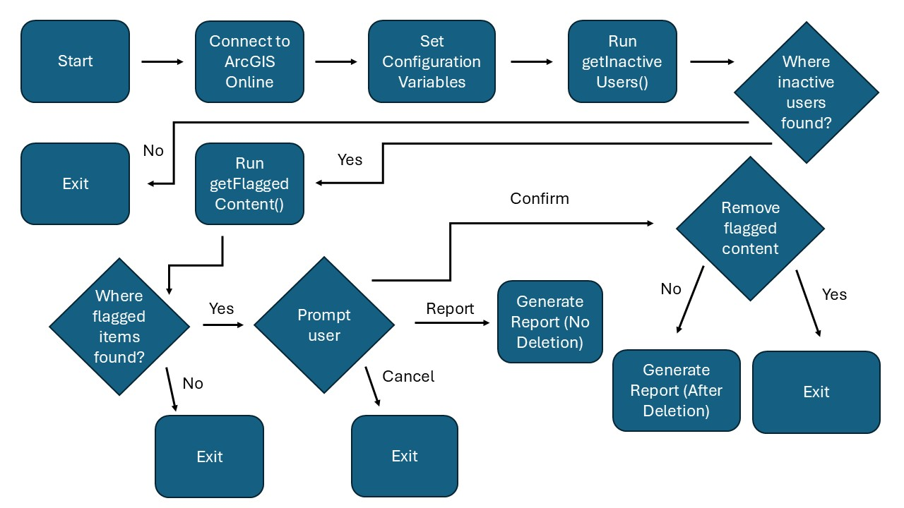

# Managing Content in Texas A&M University's ArcGIS Online Environment

Enrique Buruca – GEOG 476 Capstone Project  
Date: 2025-04-28

---

# Table of Contents
- [Project Motivation](#project-motivation)
- [Literature Review](#literature-review)
- [Data](#data)
- [Methods](#methods)
- [Results](#results)
- [Analyzing](#analyzing)
- [Conclusion](#conclusion)

---

# Project Motivation

Texas A&M University's ArcGIS Online environment has grown significantly over time, accumulating thousands of geospatial datasets, web maps, and applications. Much of this content has become outdated, unused, or redundant without proper oversight. Weak oversight has driven up ESRI cloud storage costs and made it harder for users to access current resources. System performance has also declined.

The project developed a Python script that identifies inactive users and redundant files, clearing out unnecessary content and improving server organization. This project aims to improve server organization, reduce storage expenses, and maintain a more efficient ArcGIS Online environment for future academic and research activities. A second motivation was creating a replicable framework usable for other institutions facing similar storage and organization challenges within their ArcGIS Online environments.

# Literature Review

The methods behind this project were constructed from official technical documentation related to the ArcGIS API for Python, ArcGIS REST APIs, and associated Python libraries such as Pandas, DateTime, and getpass. Another source of literature was an ESRI blog that dove into some tedious topics.

The first step involved using an ESRI blog to learn how to configure Visual Studio Code to work with ArcGIS Pro's Python environment. Then, the documentation for ArcGIS API for Python gave the necessary steps to authenticate securely into ArcGIS Online. The documentation also gave different options for retrieving user and item metadata. Pandas described how to filter and manipulate metadata in Python properly. The ArcGIS REST APIs explained which metadata attributes to use and highlighted possible errors when manipulating the data. The project used industry-supported practices to avoid problems with future API updates.

# Data

All the data used in this project was sourced directly from the Texas A&M University ArcGIS Online environment. The datasets accessed included the following:

- **User Metadata:** Includes username, last login timestamp, email address, and full name.
- **Item Metadata:** Includes the title, owner, last modified timestamp, last viewed timestamp, item type, sharing status, and item URL.

This information was important in identifying the inactive users in the organization and filtering the outdated or redundant content later. The tools used for data collection and management were:

- **ArcGIS API for Python:** Used for querying user and content information with the functions `gis.users.search()` and `gis.content.search()`.
- **Pandas:** Used to structure, filter, and manipulate the collected metadata tables.
- **DateTime:** Used to calculate the cutoff dates for inactivity and last modifications.
- **Getpass:** Used to securely enter login credentials without saving passwords in the script.

The project processed one thousand user accounts and focused the analysis on items shared internally within the Texas A&M University environment. Excluding public content kept the dataset focused and manageable for internal maintenance.

# Methods

Implementing a modular script for the project separated each task into different functions. Separating tasks made troubleshooting easier, kept things organized, and allowed for future improvements.

### Connection and Authentication

The script used the `GIS()` function to securely connect to ArcGIS Online and verify administrative permissions at login. Then, the script used the getpass module to retrieve user credentials and avoid securely hardcoding sensitive information.

### Metadata Retrieval

Two main functions handled metadata retrieval:

- `gis.user.search()`: This function retrieves user account metadata, which includes usernames and last login dates.
- `gis.content.search()`: This function retrieves item metadata that each inactive user owns. The searches were also limited to 100 items per user.

### Inactive User Identification

The `getInactiveUsers()` function identified users who had either not logged in for over 4 years or had never logged in, as indicated by a last login value of 0. The function extracted the username, full name, email, last login, and sort key. It also applied the cutoff calculation, which used the DateTime library. It exported the results into a CSV report listing all inactive users.

### Content Flagging

The `getFlaggedContent()` function filtered items owned by inactive users. The script flagged content that had not been modified in over eight years or viewed in over one year. The script used a placeholder date when the last viewed attribute was missing. The dates were parsed and compared using the DateTime objects, and flagged items were then appended into a structured data frame to make filtering and sorting easier. The script placed all the flagged content into a list and then converted it into a CSV file for later review.

### Reporting

The `generateReport()` function compiled the total number of inactive users identified, the total number of flagged contents, and a preview of the content details. The script then saved the final report as a timestamped TXT file to ensure reliable record-keeping for future audits and evaluations.

### Review and Decision Points

After flagging content, the script used `input()` prompts to guide the following steps:

- "Report" Generates a report of flagged items without removing any content.
- "Cancel" Exits the script with no changes made.
- "Confirm" Gives an additional confirmation prompt before proceeding with the removal process.

Because of constraints, the project did not remove any content. Instead, the script generated a detailed report of potentially removable content for review.

### Flowchart



# Results

### Script Results


---

### Sample of Inactive Users Report

```csv
Username,Full Name,Email,Last Login
eb_buruca,Enrique Buruca,eb_buruca@tamu.edu,2017-04-19
jdoe,John Doe,jdoe@example.com,Never
asmith,Alice Smith,asmith@example.com,2016-10-01
...
```

[Download Full Inactive Users Report](inactive_users_20250428_093554.csv)

---

### Sample of Flagged Items Report

```csv
Title,Owner,Last Modified,Last Viewed,Sharing Status,Item URL
Old Basemap,eb_buruca,2015-06-22,2022-05-15,Organization,https://...
Survey Layer,asmith,2014-03-14,N/A,Organization,https://...
...
```

[Download Full Flagged Items Report](flagged_items_20250428_093554.csv)

---

### Sample of Cleanup Report

```plaintext
Username, Full Name, Email, Last Login
eb_buruca, Enrique Buruca, eb_buruca@tamu.edu, 2017-04-19
jdoe, John Doe, jdoe@example.com, Never
asmith, Alice Smith, asmith@example.com, 2016-10-01
...
```

[Download Full Cleanup Report](cleanup_report_20250428_093554.txt)

# Analyzing

It was apparent that content older than eight years typically consisted of outdated survey base maps and internal project layers that no longer serve active projects. Also, publicly shared but unviewed items posed a risk as obsolete or outdated information remained accessible. In addition, many inactive user accounts often owned redundant or transitional project files. These findings support a regular auditing process to maintain server health, reduce storage costs, and improve access to relevant resources.

# Conclusion

The Managing Content in Texas A&M University's ArcGIS Online Environment project created a Python script to help organize and manage server content. The script was able to:

- Securely connect to ArcGIS Online,
- Extract and analyze user and item metadata,
- Identify inactive users and outdated content,
- Generate detailed reports for review,
- Prevent accidental data loss through manual confirmation steps.

The project did not delete content without higher administrative approval and complete testing. Future improvements could include:

- Fixing pagination and indexing issues for full scans,
- Archiving older important datasets instead of deleting them,
- Building a simple graphical interface for easier use,
- Setting up an annual content audit cycle.

This project provides a strong starting point for better server management at Texas A&M University. It helps the university support academic, research, and operational goals through a more organized and efficient geospatial system.
